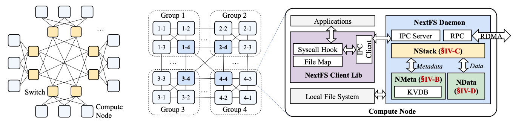
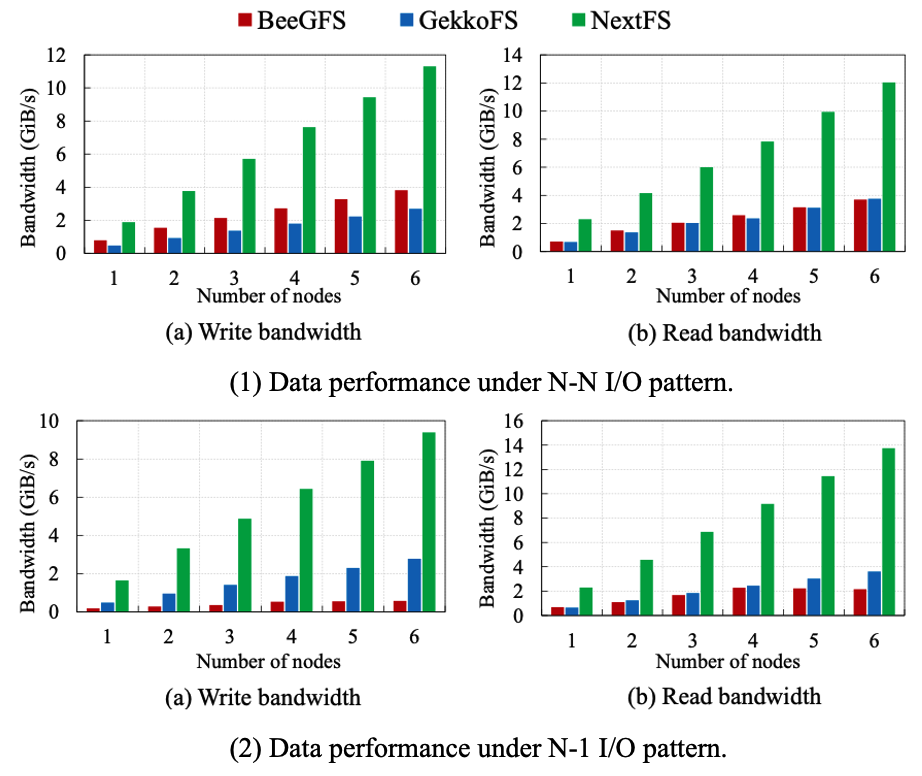
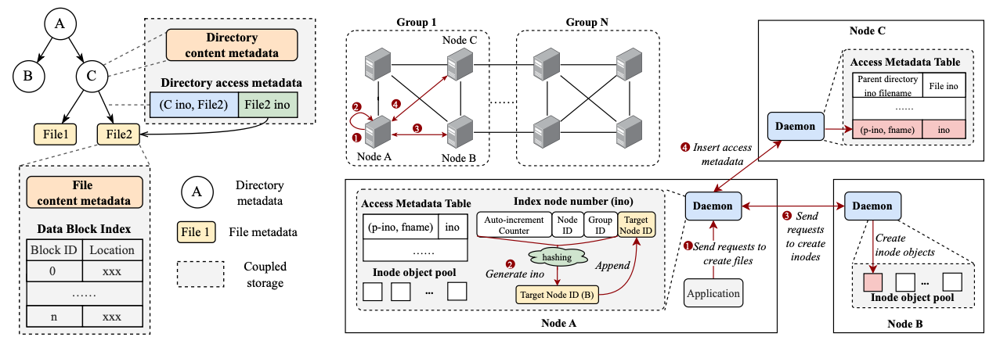

# NextFS: A Fast, Scalable Node-Local Burst Buffer File System For Large-scale HPC Applications


## Summary

NextFS is a user-space local-BB file system to **support high scalability** and **increase performance**.  The main features of NextFS are as follows:

1. Introduces an efficient metadata management mechanism based on **network-affinity grouping** to enhance metadata scalability in large-scale scenarios.
2. Implements a **NUMA-aware file system software stack**, integrating thread management, task scheduling and cache management to significantly boost performance for memory-intensive operations.
3. Employs workload-aware data management, including **file classification mechanisms** and **shared-file semantics** to efficiently handle emerging HPC workloads.

Evaluation results demonstrate that NextFS significantly outperforms state-of-the-art HPC file systems in both metadata and data throughput, while scaling efficiently across large node counts.




## Introduction

NextFS is architecturally divided into four major modules.

-  **Network-affinity grouping module** : It groups compute nodes based on the underlying network topology and performs the initial partitioning of filesystem metadata and data at the granularity of these groups.
- **Metadata management module** : It further manages the intra-group distribution of filesystem metadata.
-  **Data management module** : It is responsible for organizing and maintaining file data across compute nodes.
- **Replication module** : It ensures the backup of both filesystem metadata and data, thereby enhancing overall system reliability.

From an implementation perspective, NextFS consists of **a daemon process** and **a client component**.
The client is provided as an interception library that captures the I/O system calls issued by HPC applications. This library internally maintains the state of opened file descriptors, as well as the current read/write offsets of files. The client interacts with the local daemon through an IPC module. The IPC subsystem comprises three components—**a message dispatcher, a lock-free concurrent queue, and a data-block read/write buffer**, all of which are allocated within a shared-memory region.
 On the daemon side, the core components include the **RPC module**, the **metadata management module**, and the **data management module**, which jointly handle local I/O requests, respond to remote RPC calls, and manage the metadata and data stored on local storage devices.




## Build & Run

### Env setup

Install the required system libraries:

```bash
# capstone
sudo apt install libcapstone-dev
# rdma
sudo apt install librdmacm-dev
sudo apt install rdmacm-utils
# event
sudo apt install libevent-dev
# fmt
sudo apt install libfmt-dev
```

Update submodules:

```bash
git submodule update --init --recursive
```

#### Build from script

```bash
bash build.sh rebuild
```

Then you will find the following binaries in `build` directory

- nextfs_daemon
- libnextfs_interceptor.so

### Run NextFS Daemon

Config the following thins in `helper.sh` ，like: 

```bash	
SYSCALL_INTERCEPTOR=/home/ysy/code/NextFS/build/third_party/syscall_intercept/libsyscall_intercept.so.0
INTERCEPTOR=/home/ysy/code/NextFS/build/src/interceptor/libnextfs_interceptor.so
DAEMON=/home/wnj/Projects/NextFS/build/src/daemon/nextfs_daemon
CONFIG_TEMPLATE=./config_exp.yaml # Refer to the files in the config directory.
DATA_PATH=/mnt/nextfs/ysydata_1

# node and ip list
node_list=(s13 s12 s14 s51)
ip_list=("192.168.200.13" "192.168.200.12" "192.168.200.14" "192.168.200.51")

# mount point in user space
mount_point=/mnt/nextfs/ysy/mount
```

Generate config and send it to all nodes. This command uses `${CONFIG_TEMPLATE}` as the base template to generate node-specific configuration files, and then sends them to the corresponding nodes via SSH.

```bash
bash helper.sh install_config
```

Install the `nextfs_daemon` binary to each node:

```bash
bash helper.sh install
```

Run NextFS cluster daemon:

```bash
bash helper.sh run_daemon
```

Stop NexfFS cluster daemon:

```bash
bash helper.sh stop_daemon
```


## Client Example

The client quick-start example is  `test_all/main.cc` . Run this example:

```bash
./build/test_all/test_all
```


## Evaluate Through IOR & Mdtest

### Env Configuration in Paper

All experiments are conducted on a 6-node cluster. Each node is equipped with two 100 Gbps Mellanox ConnectX-6 MT4123 InfiniBand RNICs, two Intel Xeon Gold 5318Y CPUs @2.6 GHz (each 24 cores and 48 threads), 512 GB DRAM, and 2TB NVMe SSDs (Samsung 990 PRO). The operating system is Ubuntu 20.04.6 LTS with the kernel version 5.4.0.

### IOR

Use IOR to test file read/write performance, including both N-1 and N-N patterns.

The IOR test needs to run concurrently and is used together with MPI. For detailed test commands and configurations, please refer to the `mps.sh` script. You need to configure the number of slots for each node in the `hostfile` file. Like the following:

```bash
192.168.1.14 slots=8
192.168.1.13 slots=8
```

Run workload:

```bash
bash mpi.sh
```

### Mdtest

Use mdtest to evaluate metadata access performance, including operations such as create and stat. 

Mdtest also needs to be used together with MPI.

Run workload:

```bash
bash mdtest.sh
```
